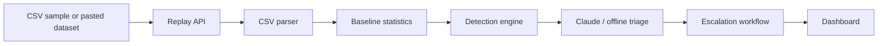

# trade-sentinel
AI-Powered Trade Surveillance &amp; Alert Triage Platform


# Trade Sentinel

Spring Boot trade surveillance and AI alert triage demo for the Wissen Technology Hackathon 2026 problem statement.

## What It Demonstrates

- CSV ingestion and replay of order/trade events.
- Three suspicious-pattern detectors:
  - Layering / spoofing
  - Wash trading
  - Momentum ignition / price spike manipulation
- Claude-powered triage when `ANTHROPIC_API_KEY` is configured.
- Deterministic offline triage fallback for reliable demos.
- False-positive reasoning, confidence scoring, case notes, and recommended actions.
- Automated workflow actions: compliance case, notification, watchlist update, analyst task, and audit log.
- A no-build browser dashboard served by Spring Boot.

## Architecture



## Run

```powershell
.\gradlew.bat bootRun
```

Open:

```text
http://localhost:8080
```

Build a runnable jar:

```powershell
.\gradlew.bat clean bootJar
java -jar build\libs\trade-sentinel-0.0.1-SNAPSHOT.jar
```

## Claude API Key

## Claude API Key

The app works without a key in offline triage mode. To enable Claude triage **locally** (and never commit credentials to GitHub):

1. Copy the example to a local-only file:
   ```bash
   cp src/main/resources/application-local.properties.example src/main/resources/application-local.properties
   ```

2. Edit `application-local.properties` and add your API key:
   ```properties
   anthropic.enabled=true
   anthropic.api-key=sk-ant-your-key-here
   anthropic.model=claude-3-5-sonnet-latest
   ```

3. Run the app:
   ```powershell
   .\gradlew.bat bootRun
   ```

**IMPORTANT**: `application-local.properties` is in `.gitignore` and will never be committed. The default `application.properties` has `anthropic.enabled=false`, so credentials are safe in version control.

**Production deployment**: Use environment variables or secure secrets management (GitHub Secrets, HashiCorp Vault, etc.):
   ```powershell
   $env:ANTHROPIC_ENABLED="true"
   $env:ANTHROPIC_API_KEY="sk-ant-..."
   .\gradlew.bat bootRun
   ```

## Demo Script

1. Open the dashboard and click `Run Replay`.
2. Show the summary queue: 37 events, 3 alerts, escalated workflow actions.
3. Open the layering alert and point to cancellation ratio, median cancel time, and opposite-side fills.
4. Open the wash trading alert and show repeated buy/sell cycles with matched quantities.
5. Open the momentum ignition alert and show short-window price impact.
6. Explain the triage block: verdict, confidence, false-positive probability, risk factors, false-positive checks, case note.
7. Show workflow automation: case ownership, priority, SLA, notification, and watchlist.

## Scoring Rubric Mapping

- AI Triage Quality: structured Claude prompt, offline parity, case note, false-positive factors.
- Pattern Detection: three detectors with severity and evidence.
- Automation & Workflow: case, notification, watchlist, analyst task, audit trail.
- Working Demo: self-contained replay and dashboard.
- API Efficiency: one Claude call per generated alert, compact JSON prompt, offline fallback.
- Docs: README plus `docs/API.md` and `docs/HACKATHON_PLAYBOOK.md`.

## API

- `GET /api/health` returns runtime status and whether Claude is configured.
- `GET /api/sample` returns bundled sample CSV.
- `POST /api/replay` accepts JSON with `csv` and optional `replayDelayMs`.

See [docs/API.md](docs/API.md) for response shapes.

## CSV Schema

Required columns:

```csv
order_id,trader_id,account_id,symbol,exchange,side,quantity,price,event_type,event_time
```

Allowed `event_type` values:

```text
NEW, MODIFY, CANCEL, EXECUTE
```

`event_time` should be ISO-8601:

```text
2026-06-06T10:00:00.000Z
```

## Test

```powershell
.\gradlew.bat test
.\gradlew.bat bootJar
```

## Known Limits

- No real exchange feed, Kafka, database, Slack, Jira, or case-management integration.
- Baselines are computed from replay data, not a historical 30-day warehouse.
- Offline triage is deterministic and demo-safe; Claude triage requires network and a valid API key.
