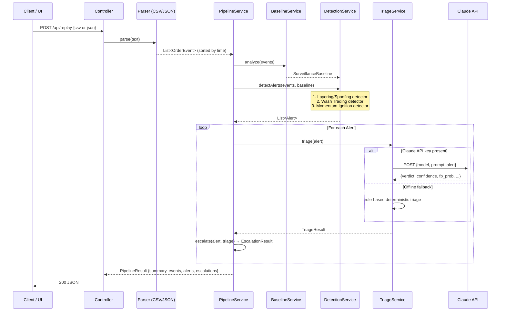

# Trade Sentinel — Architecture & Design

> **Project**: Wissen Technology Hackathon 2026  
> **Stack**: Java 17 · Spring Boot 3.x · Gradle 8 · Claude Sonnet 4 · Vanilla JS Dashboard

---

## 1. System Overview

Trade Sentinel is a complete, self-contained trade surveillance platform. It ingests order-event
streams (CSV or JSON), detects three classes of market manipulation, triages each alert via
Claude AI (with deterministic offline fallback), and automates compliance workflow actions —
all served through a single Spring Boot process with an interactive web dashboard.

```
 ┌───────────────────────────────────────────────────────────────────────┐
 │                        TRADE SENTINEL                                 │
 │                                                                       │
 │  Browser ──► Static Dashboard (index.html)                           │
 │       │                                                               │
 │  REST Client ──► TradeSentinelController                              │
 │                         │                                             │
 │              ┌──────────┼──────────────┐                              │
 │              │          │              │                              │
 │         CsvParser  JsonParser    PipelineService                      │
 │              └──────────┘              │                              │
 │                   │         ┌──────────┼──────────────┐              │
 │             [OrderEvent]    │          │              │               │
 │                        BaselineSvc  DetectionSvc  TriageSvc          │
 │                             │          │              │               │
 │                        [Baselines] [Alert×3]    [Claude/Offline]     │
 │                                                       │               │
 │                                              Anthropic Claude API    │
 └───────────────────────────────────────────────────────────────────────┘
```

---

## 2. Component Diagram

```mermaid
graph TB
    subgraph Frontend["Frontend (Browser)"]
        UI[index.html Dashboard\nFilter · Expand · Workflow view]
    end

    subgraph REST["REST API — Spring Boot :8080"]
        Ctrl[TradeSentinelController\nGET /api/health\nGET /api/sample\nPOST /api/replay\nPOST /api/replay-json]
        EH[GlobalExceptionHandler\n@RestControllerAdvice]
    end

    subgraph Parsers["Ingestion Layer"]
        CSV[CsvOrderParser\nRFC-4180 compliant\nrequired-column validation]
        JSON[JsonOrderParser\nSurveillance-style JSON\nExpands records → events]
    end

    subgraph Pipeline["Pipeline Services"]
        PS[PipelineService\nOrchestrates full pipeline\nBuilds PipelineResult]
        BS[BaselineService\nSample cancel ratio\nPer-trader-symbol stats]
        DS[DetectionService\nLayering/Spoofing\nWash Trading\nMomentum Ignition]
        TS[TriageService\nClaude primary\nOffline deterministic fallback]
    end

    subgraph External["External"]
        Claude[Anthropic Claude API\nclaude-sonnet-4-20250514]
    end

    UI -->|HTTP fetch| Ctrl
    Ctrl --> EH
    Ctrl --> CSV
    Ctrl --> JSON
    CSV -->|List OrderEvent| PS
    JSON -->|List OrderEvent| PS
    PS --> BS
    PS --> DS
    BS -->|SurveillanceBaseline| DS
    DS -->|List Alert| PS
    PS --> TS
    TS -->|POST /v1/messages| Claude
    Claude -->|verdict JSON| TS
    TS -->|TriageResult| PS
    PS -->|PipelineResult| Ctrl
    Ctrl -->|200 JSON| UI
```

---

## 3. Full Pipeline Sequence



---

## 4. Detection Patterns

### 4a. Layering / Spoofing
```
Group by: traderId + symbol
Windows : all cancelled orders per group

Fires when ALL of:
  ├── largeCancelledOrders ≥ 6   (qty ≥ 25,000)
  ├── cancelRatio          ≥ 70%
  └── medianCancelTimeMs   ≤ 1,500 ms

Score   = 55 + cancelRatio×25 + largeOrders×2 + min(oppExecs,5)×3
Severity: HIGH if score ≥ 85, else MEDIUM

Metrics emitted: cancelRatioPct · sampleCancelRatioPct · cancelRatioLift
                 medianCancelTimeMs · largeCancelledOrders · oppositeSideExecutions
```

### 4b. Spoofing (single-order)
```
Per order pair (NEW → CANCEL, no EXECUTE):

Fires when ALL of:
  ├── cancelMs       ≤ 2,000 ms
  ├── order qty      ≥ 5× baseline avg qty for trader+symbol
  └── No EXECUTE event for same orderId

Score   = 60 + avgQtyMultiplier×4 + spoofCount×5 + speed_bonus
Severity: HIGH if score ≥ 80, else MEDIUM

Metrics emitted: spoofOrderCount · avgCancelTimeMs · avgSizeMultiplier
                 baselineAvgQuantity · fillRate (always 0)
```

### 4c. Wash Trading
```
Group by: traderId + symbol (EXECUTE events only)

Fires when ALL of:
  ├── cycles ≥ 3   (BUY↔SELL pairs within 60s)
  ├── size delta  ≤ 15% between paired executions
  └── gap between each pair ≤ 60 seconds

Score   = 60 + cycles×8 + min(totalQty/5000, 10)
Severity: HIGH if score ≥ 85, else MEDIUM

Metrics emitted: buySellCycles · windowSeconds · totalExecutedQuantity
                 avgExecutionQuantity · avgGapSeconds
```

### 4d. Momentum Ignition
```
Group by: traderId + symbol (EXECUTE events only)
Window  : 90-second sliding window

Fires when ALL of:
  ├── executions in window ≥ 5
  ├── same-side executions ≥ 5
  ├── price move           ≥ 1%
  └── total qty            ≥ 30,000

Score   = 62 + priceMove×8 + executions×3 + min(qty/10000, 8)
Severity: HIGH if score ≥ 85, else MEDIUM

Metrics emitted: aggressiveExecutions · dominantSide · windowSeconds
                 priceMovePct · totalExecutedQuantity · baselineMaxPriceMovePct
```

---

## 5. Triage Layer

### Claude Path
```
Model   : claude-sonnet-4-20250514   (env: ANTHROPIC_MODEL)
Timeout : 20 seconds
Temp    : 0.1 (deterministic)
Max tok : 500

Prompt includes:
  - Role: compliance analyst
  - Rubric: treat rules as candidates, not proof; escalate only coherent evidence
  - Required JSON schema (verdict · confidence · falsePositiveProbability ·
    reason · riskFactors · falsePositiveFactors · recommendedActions · caseNote)
  - Full Alert object as JSON

Response parsing: verdict → ESCALATE | REVIEW | IGNORE
                  confidence 0-100, fp_probability 0-100
```

### Offline Fallback (no API key)
```
Verdict: ESCALATE if score ≥ 75, else REVIEW
FP prob: max(3, min(60, 100 - score))

Pattern-specific reason, risk factors, false-positive factors, and
recommended actions are returned in the same schema — UI sees no difference.
Source field: "offline-rule-triage"
```

---

## 6. Workflow Automation

| Verdict | Actions Generated |
|---------|-------------------|
| **ESCALATE** | CASE_CREATED → Surveillance L2 (P1 · 2h SLA)<br>NOTIFICATION → compliance-ops (P1 · 15m SLA)<br>WATCHLIST_UPDATE → traderId (P2 · 72h SLA) |
| **REVIEW** | CASE_CREATED → Surveillance L1 (P2 · 1 business day)<br>ANALYST_TASK → false-positive review (P3 · 1 business day) |
| **IGNORE** | SUPPRESSED → audit trail (P4)<br>AUDIT_LOG → triage-decision (immutable) |

---

## 7. Data Models

```
OrderEvent
  orderId · traderId · accountId · symbol · exchange
  side · quantity · price · eventType · eventTime

Alert
  alertId · pattern · traderId · accountId · symbol
  severity · score · metrics(Map) · evidence(List<OrderEvent>) · createdAt

TriageResult
  verdict · confidence · falsePositiveProbability · reason
  riskFactors · falsePositiveFactors · recommendedActions · caseNote · source

TriagedAlert       = Alert + TriageResult
EscalationResult   = alertId + List<ActionResult>
ActionResult       = id · type · target · status · owner · priority · sla · createdAt

PipelineResult
  summary(PipelineSummary) · events · alerts · escalations

PipelineSummary
  eventsIngested · alertsGenerated · highSeverity
  escalated · review · ignored · triageSource
```

---

## 8. CSV Input Schema

```
order_id, trader_id, account_id, symbol, exchange, side,
quantity, price, event_type, event_time
```

`event_type` values: `NEW` · `MODIFY` · `CANCEL` · `EXECUTE`

---

## 9. JSON Input Schema (surveillance-style)

```json
{
  "orders": [
    {
      "order_id":    "ORD-XXXX",
      "trader_id":   "T-1007",
      "instrument":  "WIPRO",
      "side":        "BUY",
      "qty":         52000,
      "price":       450.25,
      "placed_at":   "2026-06-06T10:00:00Z",
      "cancelled_at": null,
      "filled_at":   "2026-06-06T10:00:30Z",
      "status":      "FILLED"
    }
  ]
}
```

Each JSON record expands into 1–3 `OrderEvent` rows (NEW always; CANCEL if `cancelled_at` set;
EXECUTE if `filled_at` set).

---

## 10. API Endpoints

| Method | Path | Description |
|--------|------|-------------|
| `GET` | `/api/health` | Runtime status + Claude config flag |
| `GET` | `/api/sample` | Sample CSV data for demo |
| `GET` | `/api/sample-json` | Sample JSON data for demo |
| `POST` | `/api/replay` | Run full pipeline from CSV body |
| `POST` | `/api/replay-json` | Run full pipeline from JSON body |

---

## 11. Frontend Dashboard

Single-page app at `src/main/resources/static/index.html`:

```
┌─────────────────────────────────────────────────────────┐
│  Header: Trade Sentinel · Claude status badge            │
├──────────────────┬──────────────────────────────────────┤
│ Sidebar          │ Main Content                          │
│  • CSV textarea  │  • Pipeline summary (7 KPI cards)     │
│  • Load sample   │  • Alert queue (expandable cards)     │
│  • JSON toggle   │    – metrics · evidence · triage      │
│  • Run Replay    │    – verdict pill · case note          │
│                  │  • Filter bar (verdict/severity/pat.) │
│                  │  • Event replay table                  │
│                  │  • Workflow automation panel           │
└──────────────────┴──────────────────────────────────────┘
```

---

## 12. Configuration

```bash
# Required for Claude triage
export ANTHROPIC_API_KEY=sk-ant-...

# Optional model override (default: claude-sonnet-4-20250514)
export ANTHROPIC_MODEL=claude-sonnet-4-20250514
```

---

## 13. Build & Run

```bash
# Gradle wrapper
./gradlew bootRun

# Build fat JAR
./gradlew clean bootJar
java -jar build/libs/trade-sentinel-*.jar

# Tests
./gradlew test
```

**Default port**: `8080` — Dashboard at `http://localhost:8080`
