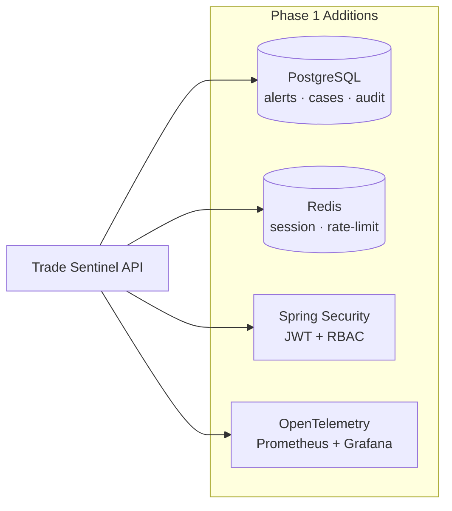
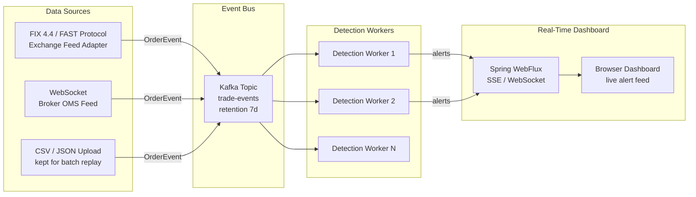
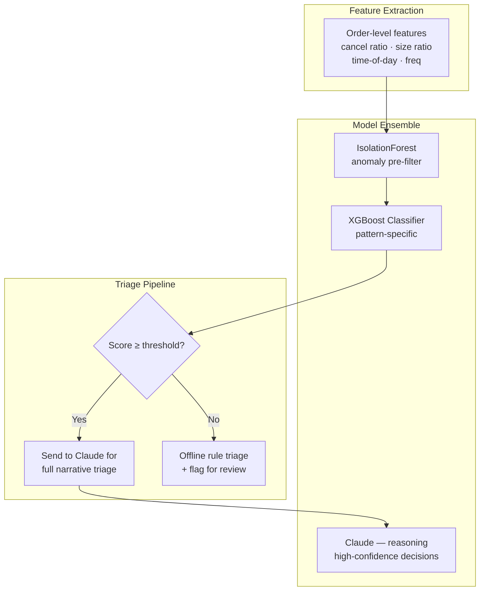
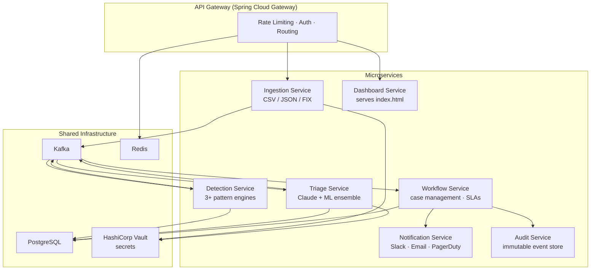

# Trade Sentinel — Scaling Roadmap

> From hackathon MVP to production-grade surveillance platform.  
> Each phase is independently deployable; later phases build on earlier ones.

---

## Current State (MVP)

```
CSV / JSON → [In-process pipeline] → REST JSON → Browser dashboard
  · In-memory, single JVM, no auth, no persistence
  · Claude AI triage with offline deterministic fallback
  · 3 pattern detectors: Layering/Spoofing · Wash Trading · Momentum Ignition
```

---

## Phase 1 — Persistence, Auth & Observability

**Goal**: Make the MVP production-safe for a single organisation.



### Feature Details

| Feature | Technology | Notes |
|---------|-----------|-------|
| Alert persistence | PostgreSQL + Flyway | Alerts, triage results, escalation actions |
| Audit trail | Append-only event log table | Immutable; never DELETE or UPDATE |
| Session + rate limiting | Redis | Prevent Claude API cost abuse |
| Authentication | Spring Security 6 + JWT | Role hierarchy: `ANALYST → SUPERVISOR → ADMIN` |
| Authorization | Method-level `@PreAuthorize` | Analysts see own queue; supervisors see all |
| Metrics | Spring Actuator + Micrometer | Detection latency, triage source ratio, alert volumes |
| Distributed tracing | OpenTelemetry → Tempo | End-to-end trace per replay run |

### Database Schema (Phase 1)

```sql
CREATE TABLE order_events (
    id           BIGSERIAL PRIMARY KEY,
    run_id       UUID NOT NULL,
    order_id     TEXT, trader_id TEXT, account_id TEXT,
    symbol       TEXT, exchange TEXT, side TEXT,
    quantity     INT, price DECIMAL(18,6),
    event_type   TEXT, event_time TIMESTAMPTZ,
    ingested_at  TIMESTAMPTZ DEFAULT now()
);

CREATE TABLE alerts (
    alert_id     TEXT PRIMARY KEY,
    run_id       UUID NOT NULL,
    pattern      TEXT, trader_id TEXT, account_id TEXT,
    symbol       TEXT, severity TEXT, score INT,
    metrics      JSONB, evidence JSONB,
    created_at   TIMESTAMPTZ DEFAULT now()
);

CREATE TABLE triage_results (
    id                       BIGSERIAL PRIMARY KEY,
    alert_id                 TEXT REFERENCES alerts(alert_id),
    verdict                  TEXT, confidence INT, fp_probability INT,
    reason                   TEXT, risk_factors JSONB,
    fp_factors JSONB, recommended_actions JSONB,
    case_note TEXT, source TEXT,
    triaged_at               TIMESTAMPTZ DEFAULT now()
);

CREATE TABLE escalation_actions (
    action_id  TEXT PRIMARY KEY,
    alert_id   TEXT REFERENCES alerts(alert_id),
    type TEXT, target TEXT, status TEXT,
    owner TEXT, priority TEXT, sla TEXT,
    created_at TIMESTAMPTZ DEFAULT now()
);
```

---

## Phase 2 — Real-Time Streaming Ingestion

**Goal**: Replace CSV replay with live market data feeds.



### Key Design Decisions

| Decision | Choice | Reason |
|----------|--------|--------|
| Message broker | Apache Kafka | Durable replay, consumer groups per detector |
| Partitioning | By `traderId` | All events for one trader go to the same partition → stateful detection without shuffle |
| State store | Redis sorted sets | Per-trader sliding-window order books |
| Baseline update | 30-day rolling window | Recomputed nightly via batch job, cached in Redis |
| Real-time push | Spring WebFlux + SSE | Alerts appear in dashboard <1 second after detection |

### Kafka Topic Layout

```
trade-events         → raw OrderEvent stream (key = traderId)
surveillance-alerts  → generated Alert objects
triage-results       → enriched TriagedAlert (after Claude)
escalation-actions   → workflow actions produced by PipelineService
```

---

## Phase 3 — Advanced Detection & ML

**Goal**: Detect more patterns, reduce false positives with ML.

### New Pattern Detectors

| Pattern | Detection Logic |
|---------|----------------|
| **Front-Running** | Trader executes before a large institutional order in same symbol |
| **Painting the Tape** | Multiple accounts with shared beneficial owner trade between each other |
| **Ramping / Marking Close** | Aggressive executions in final minutes of session to push closing price |
| **Cross-Market Manipulation** | Coordinated positions across related instruments (e.g. equity + derivative) |
| **Quote Stuffing** | Extreme order submission rate with immediate cancellation (>500 orders/sec) |
| **Cornering the Market** | Single trader acquiring dominant market share of available supply |

### ML Pipeline



**Benefits**:
- ML pre-filter handles high-volume, low-confidence candidates cheaply
- Claude focuses on complex, high-confidence cases → lower API cost
- Model retrained monthly on confirmed false-positive feedback

---

## Phase 4 — Microservices Decomposition

**Goal**: Independent scaling of each concern; separate deployment lifecycles.



### Scaling Targets

| Service | Scale Unit | Bottleneck |
|---------|-----------|-----------|
| Ingestion | Kafka partitions | Network I/O |
| Detection | CPU cores × stateless workers | Compute |
| Triage | Claude API rate limit | External API |
| Workflow | DB connections | PostgreSQL |
| Notification | Webhook throughput | External services |

---

## Phase 5 — Enterprise Integrations

**Goal**: Connect to existing compliance and operations tooling.

| Integration | Purpose | Method |
|-------------|---------|--------|
| **Jira / ServiceNow** | Automatic case creation | REST API + webhook |
| **Slack / Teams** | Real-time compliance ops alerts | Webhook + bot |
| **PagerDuty** | On-call escalation for critical alerts | PagerDuty Events API v2 |
| **Email (SendGrid)** | Regulatory notification letters | Template + SMTP |
| **SEBI / ESMA Reporting** | Regulatory MAR reports | PDF/XML generation |
| **Bloomberg / Refinitiv** | Market context for false-positive reduction | REST / B-PIPE |
| **Identity Provider** | SSO for compliance teams | SAML 2.0 / OIDC |
| **Data Warehouse (Snowflake)** | 30-day historical baselines | Kafka → Snowflake connector |
| **Elastic SIEM** | Log shipping + threat correlation | Logstash + ECS format |

---

## Scaling Summary

```
Phase 1  →  Persistent, authenticated, observable single-node
Phase 2  →  Real-time streaming from live exchange feeds
Phase 3  →  5+ pattern types + ML pre-filter → lower Claude cost
Phase 4  →  Independently scalable microservices
Phase 5  →  Full enterprise compliance platform
```

### Estimated Throughput Targets

| Phase | Events/sec | Alerts/day | Latency (detect→triage) |
|-------|-----------|-----------|------------------------|
| MVP   | ~1 (replay) | <100 | seconds (batch) |
| Phase 1 | 100 | 500 | <5 seconds |
| Phase 2 | 10,000 | 5,000 | <2 seconds |
| Phase 3 | 50,000 | 20,000 | <500 ms |
| Phase 4+ | 500,000+ | 100,000+ | <100 ms |

---

## Feature Backlog (Prioritised)

### High Priority
- [ ] PostgreSQL persistence for alerts + triage
- [ ] JWT authentication + RBAC (analyst / supervisor / admin)
- [ ] `ANTHROPIC_API_KEY` injection via env var (remove from code)
- [ ] Re-enable and tune SPOOFING single-order detector
- [ ] Rate limiting on Claude API calls (token bucket)
- [ ] Spring Boot Actuator health + metrics endpoints
- [ ] JSON ingestion endpoint (`POST /api/replay-json`)
- [ ] Global exception handler with structured error responses

### Medium Priority
- [ ] WebSocket / SSE for real-time alert push to dashboard
- [ ] Kafka consumer for live order event ingestion
- [ ] Redis for per-trader sliding-window state
- [ ] 30-day historical baseline from data warehouse
- [ ] Front-running detector
- [ ] Wash-trading cross-account (beneficial owner) enrichment
- [ ] Unit test coverage > 80%

### Lower Priority
- [ ] ML pre-filter (IsolationForest + XGBoost) to reduce Claude calls
- [ ] Jira / ServiceNow case creation webhook
- [ ] Slack / PagerDuty notifications
- [ ] SEBI / ESMA regulatory report generation
- [ ] Multi-tenancy (schema-per-tenant PostgreSQL)
- [ ] Momentum Ignition reversal trade detection
- [ ] Quote stuffing detector
- [ ] Cross-market manipulation detector


